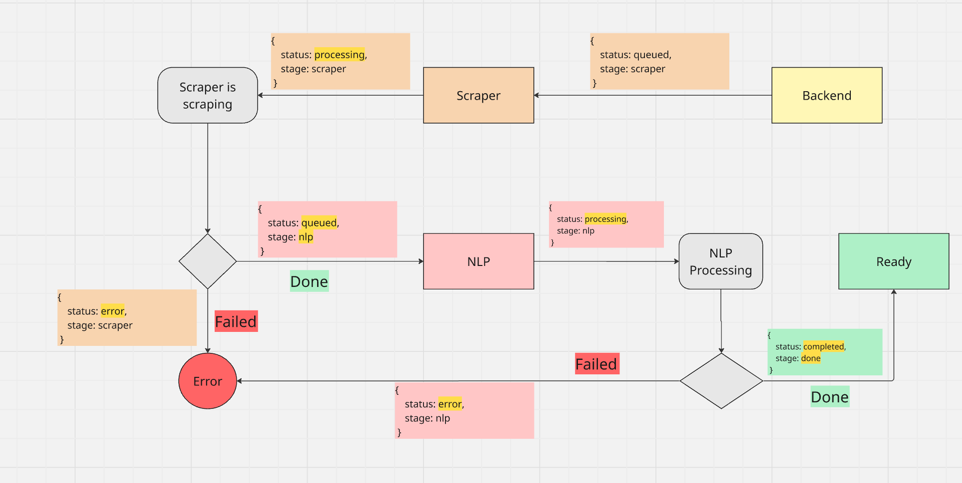

## Job queue Documentation


## Job Lifecycle cycle

#### Initial request
```
{ status: "queued", stage: "scraper" }
```

#### Scraper picks it up

```{ status: "processing", stage: "scraper" }```

#### Scraper finishes
```{ status: "queued", stage: "nlp" }```

#### NLP picks up
```{ status: "processing", stage: "nlp" }```

#### NLP finishes
```{ status: "completed", stage: "done" }```

### Any failure
```
{ status: "error", stage: "scraper" }
{ status: "error", stage: "nlp" }
```

| Stage   | Status      | Owner     | Meaning                                      |
|---------|-------------|-----------|----------------------------------------------|
| scraper | queued      | Scraper   | Job is waiting to be picked up for scraping  |
| scraper | processing  | Scraper   | Scraper is currently processing the job      |
| scraper | error       | Scraper   | Scraper failed to process the job            |
| nlp     | queued      | NLP       | Ready for NLP processing                     |
| nlp     | processing  | NLP       | NLP is currently working on it               |
| nlp     | error       | NLP       | NLP pipeline failed                          |
| done    | completed   | System    | Job is fully processed and data is ready     |



## Job Queue API Contracts
Lightweight orchestration layer for managing app review processing jobs (scraping + NLP).

---
### Add a New Job
**POST** `/queue/add`

```json
{
  "app_id": "com.spotify.music"
}
```
**Responses**

If exists and completed
```
{ "status": "exists", "message": "Already done" }
```

If Already in queue:
```
{ "status": "queued_already", "stage": "scraper", "current_status": "processing" }
```
If  **New Job**

```
{ "status": "queued", "stage": "scraper", "job_id": "abc123" } 
```


### To get the oldest job from queue
GET /queue/poll?stage=scraper&status=queued&limit=1

Used by workers (scraper, NLP) to fetch the next job(s) they can process.

Query Params
- stage (required): scraper or nlp or any
- status (required): queued, processing, completed or any
- limit (optional): default is 1

``` 
[
  {
    "job_id": "abc123",
    "app_id": "com.spotify.music",
    "stage": "nlp",
    "status": "queued",
    "requested_at": "...",
    "updated_at": "..."
  }
]
```
### Update Queue
POST /queue/<job_id>/update
```
{
  "status": "processing", // queued | processing | completed | error
  "stage": "nlp" // scraper | nlp | done
}
```
If Job not found
```
{
    "error": "Job not found"
}
```
### Status
 GET /queue/status/<app_id>
 ```
 {
  "status": "processing",
  "stage": "nlp",
  "requested_at": "...",
  "updated_at": "..."
}
 ```

### Queue Overview
GET /queue/overview
```
{
  "timestamp": "2025-04-20T09:00:00Z",
  "active_jobs": [
    {
      "app_id": "com.spotify.music",
      "status": "queued",
      "stage": "scraper",
      "requested_at": "...",
      "updated_at": "..."
    }
  ],
  "done_jobs_today": 3
}
```

**Stages:**
- scraper
- nlp
- done

**Statuses:**
- queued
- processing
- completed
- error


## DB schema
**jobs**
```
{
  "_id": ObjectId("..."),
  "job_id": "abc123",            
  "app_id": "com.spotify.music",

  "status": "queued",                  // queued | processing | completed | error
  "stage": "scraper",                  // scraper | nlp | done

  "requested_at": ISODate("2025-04-20T08:00:00Z"),
  "updated_at": ISODate("2025-04-20T08:30:00Z"),

  "error_message": null,               // (only set if status = error)
  "retries": 0,                        // (for future retry logic)
}
```

**job_history**
```
{
  "_id": ObjectId("..."),
  "job_id": abc123,           
  "app_id": "com.spotify.music",
  "timestamp": ISODate("2025-04-20T08:10:00Z"),
  "stage": "scraper",
  "status": "processing"
}
```