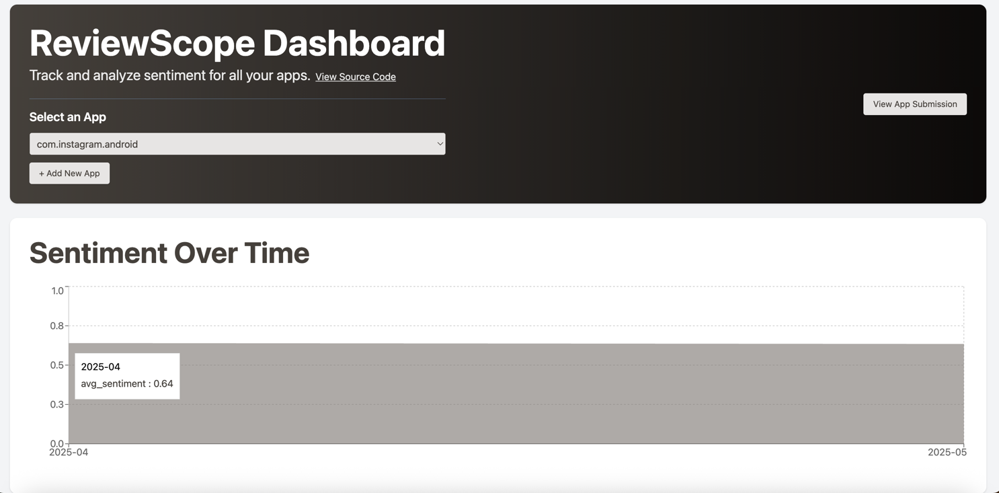
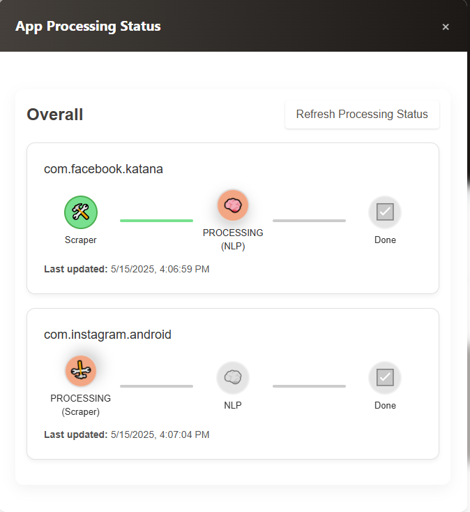
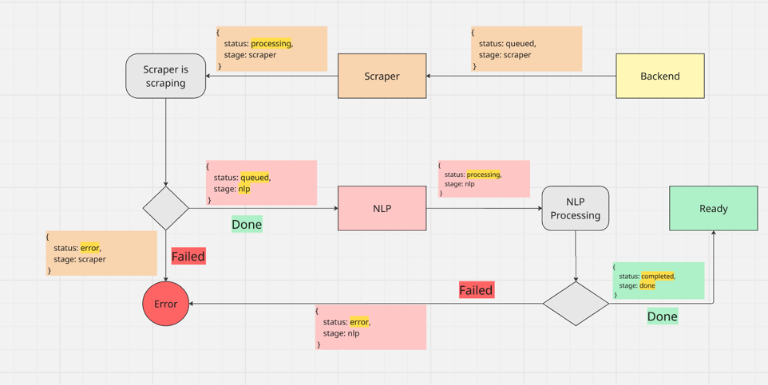

# ReviewScope
[](https://github.com/AriBhuiya/ReviewScope/graphs/contributors)
[](https://github.com/AriBhuiya/ReviewScope/stargazers)
[](./LICENSE)

 **Understand user sentiment at scale** — ReviewScope is a minimal, modular, and fully containerized pipeline to **scrape, analyze, and visualize Google Play Store app reviews** using real NLP models.

A minimal and modular end-to-end Dashboard - from review collection to sentiment analysis to dashboard-ready insights. Use as a whole or only handful of components - it is designed with flexibility in mind.

## 🚀 Live Demo
Curious to see ReviewScope in action?

🔎 **Before you try, know how to get a package name of the app:**  
> Go to the Play Store page of the app — it's the last part of the URL.  
**Example:** [https://play.google.com/store/apps/details?id=com.spotify.music](https://play.google.com/store/apps/details?id=com.spotify.music) → `com.spotify.music`


👉 **[Try the Live Demo](https://reviewscope.aribhuiya.com/)**

- Submit any Google Play app (e.g., `com.spotify.music`)
- Watch real reviews get scraped and analyzed
- Explore visualizations like:
  - Sentiment trends over time
  - Top keywords and themes
  - Review-level sentiment breakdown

> 💡 Best viewed on desktop for the full dashboard experience.




Asynchronous - distributed sentiment parsing


> Simple to run `docker compose up` 
---

## About
This repo contains the source code of ReviewScope - a minimal and modular end to end sentiment analysis dashboard for Playstore app reviews.

### Features

#### 🧑‍💻 User-Level
- 📦 Scrapes real user reviews (configurable count) from the Google Play Store.  
  *(Apple App Store support is stubbed — contributions welcome!)*
- 🧠 Supports sentiment analysis using both `VADER` and HuggingFace transformers.  
  Each review is classified as `POSITIVE`, `NEGATIVE`, or `NEUTRAL` with an associated score (0–1).
- 📊 Visualizes rating distributions
- ☁️ Displays top **themes** and **keywords** as interactive word clouds

#### Developer-level
- ⚙️ **End-to-end** pipeline — from ingestion to visualization — fully automated with Docker (Works out of the box!)
- 🔌 Configuration-driven design (via `.env` files)
- 🧩 Microservice architecture — components can be distributed across physical/virtual machines or replaced independently
- 🔄 Plug-and-play modularity — easily swap models, queues, or databases
- 📦 Fully containerized with clean `Dockerfile`(s) and a central `docker-compose.yml`

## ⚙️ Architecture

The system is composed of six loosely coupled microservices:


### 1. 🖥️ Dashboard Frontend  
A minimal dashboard built with `Vite + React`.  
Runs on `localhost:3000` when containerized.  

Comes with a `Dockerfile` for easy build and deployment.  
It’s recommended to use the [Minimalistic run setup](#minimalistic-run-setup) to launch all services together.


### 2. 🛠️ Dashboard Backend  
A lightweight REST API built with `Go` using the `gin-gonic` framework.  
Includes a `DAL` layer to support database switching.  

Exposes APIs to the frontend and is the **only service exposed externally**.

### 3. 🔍 Scraper  
`Python3` based microservice that wraps the `google-play-scraper` library.  
Fully configurable: scrape by `country`, `language`, review `count`, and `sort order`.  

> To increase review volume for sentiment analysis, increase the `review_count` parameter in the config.

A stub for Apple App Store scraping is included for future extension.


### 4. 🧠 NLP Engine  
A pluggable Python module for processing review sentiment.  
Supports:
- `VADER` (lightweight, rule-based)
- `HuggingFace` models (transformer-based)

Future model support can be added via the existing interface.

---

### 5. 📬 Job Queue  
Acts as the coordinator for the entire pipeline.  
Backed by MongoDB but wrapped with a `FastAPI` interface for flexibility.  

Decoupled via a `DAL` layer — making it easy to switch to `SQLite`, a managed queue, or another database.

#### Why a job queue?
- Enables each microservice to operate independently and asynchronously
- Adds resilience to failure — if one service goes down or restarts, others continue
- Allows services like the Scraper or NLP Engine to run on custom schedules (e.g., every hour, once a day)
- Supports future horizontal scaling — run multiple NLP workers or scrapers in parallel
- Makes the system observable and extensible by centralizing job status, retries, and metadata


### 6. 🗃️ MongoDB  
Stores all reviews, sentiment data, metadata, and job states.  
Used across all services.

No ORM is used in the entire repo — keeping things lightweight and transparent.  
Database interactions are abstracted via DALs for easy migration.

> MongoDB is bundled with the project via Docker Compose.  
> If you have your own Mongo setup, configure connection strings in the `.env` files of each service.


# 🧠 System Architecture — ReviewScope

ReviewScope is a distributed, modular system that scrapes app reviews from the Play Store, performs sentiment analysis, and presents the results on a clean dashboard.

This section explains **how the system works** end to end, and how each component fits into the larger picture.

---

## 📊 At a Glance

The system supports two core flows:

### 1. **Cached View (Pre-scraped apps)**

- Users can select from previously processed apps.
- The backend fetches cached reviews, sentiments, and metadata (themes/keywords) from MongoDB.
- The UI updates instantly without needing to re-scrape anything.

> ✅ Fast and ideal for common/popular apps.

---

### 2. **On-Demand Flow (New app requests)**

Users can enter any valid Play Store package name (e.g., `com.spotify.music`). The system kicks off a fresh data pipeline.

---

## 🔁 End-to-End Job Lifecycle

Here's how a **new job flows through the system**:

### ✅ Step 1: App Validation

- The frontend sends the app ID to the **backend**.
- The backend validates the package ID with the Play Store.
- If valid, it creates a job in the **Job Queue**, with:```
    {status: “queued”, stage: “scraper”}```
---

### 🧽 Step 2: Scraping

- The **Scraper** (a Python microservice) polls the queue every 10s.
- It picks the oldest job with:```{status: “queued”, stage: “scraper”}```
- Marks it as `processing`, scrapes reviews using `google-play-scraper`.
- Saves raw reviews to MongoDB.
- Updates the job:
```{status: “queued”, stage: “nlp”}```

---

### 🧠 Step 3: Sentiment Analysis

- The **NLP Engine** (another Python service) also polls the queue.
- It picks jobs at:
```{status: “queued”, stage: “nlp”}```
- Parses reviews using **VADER** or **HuggingFace** models.
- Enriches reviews with:
  - Sentiment score (0–1)
  - Sentiment label (Positive, Negative, Neutral)
  - Keywords, themes
- Stores processed data in MongoDB.
- Updates the job:```status: “completed”, stage: “done”```

---

### 🎯 Step 4: Dashboard Display

- The **backend** reads the now-completed data from MongoDB.
- The **frontend** visualizes:
- Sentiment trends over time
- Rating distribution
- Top themes and keywords
- Recent reviews

---

## 📈 Visual Workflow



> Each stage is isolated — enabling resilience, scalability, and asynchronous execution.

The workflow status can be seen in the UI by clicking on `view app submission` button.

---

## 🧩 Why This Architecture?

This setup provides:

- ✅ **Loose coupling** between modules
- ✅ **Distributed** different modules can run on different machines
- ✅ **Fault tolerance** — failures don’t break the whole system
- ✅ **Scalability** — run scraper/NLP in parallel or on separate machines
- ✅ **Extensibility** — swap models, data sources, or queues without rewriting everything
- ✅ **Observability** — track job state throughout the pipeline

---

## 🛠️ Components Involved

| Component     | Language    / Framework    | Role                           |
|---------------|----------------------------|--------------------------------|
| Frontend      | React                      | Dashboard UI                   |
| Backend       | Go (gin-gonic)             | API layer for data + job queue |
| Job Queue     | FastAPI                    | Orchestrator (status tracker)  |
| Scraper       | Python                     | Fetches raw reviews            |
| NLP Engine    | NLTK \| Huggingface models | Performs sentiment analysis   |
| MongoDB       | N/A                        | Stores raw + enriched reviews  |

---

This design reflects a **production-style microservice system** with clear boundaries, high flexibility, and a pipeline that can be run continuously or on-demand.


---

## 🚀 Minimalistic Run Setup

The easiest way to get started is using `docker` and `docker-compose`.  
This project includes a complete, ready-to-run Compose setup for local development.

> ℹ️ Installing Docker and Docker Compose is outside the scope of this repo.  
> Refer to the official [Docker install guide](https://docs.docker.com/get-docker/) if needed.


### ✅ 1. Verify Docker & Docker Compose installation

```bash
docker --version
# Docker version 28.0.0, build f9ced58158

docker compose version
# Docker Compose version 2.33.1
````


### 📦 2. Clone the Repository
```bash
git clone https://github.com/AriBhuiya/ReviewScope.git
cd ReviewScope
```
### ⚙️ 3. Generate .env files

#### 🐧 For WSL / Linux / macOS (Recommended)
```bash
chmod +x env_init.sh
./env_init.sh
```
#### 🪟 For Windows (Not officially supported)
> ⚠️ This script is not tested on Windows.
> You may need to troubleshoot or use WSL instead (recommended).

Using Powershell:
```powershell
Set-ExecutionPolicy RemoteSigned -Scope CurrentUser
./setup-config.ps1
```

### 🌐 4. Expose Compose Network to Host
```bash
docker network create review_scope_net
```
> This step is optional, but helpful for development and container discovery.

#### If you choose to not expose docker compose network to host:
> Please modify the `docker-compose.yaml` file and set `external: true` to `false` and skip the above step.

```yaml
networks:
  review_scope_net:
    driver: bridge
    external: false # change this to false
```

### 🐳 5. Start All Services
```bash
docker-compose up
```

#### 🧱 To run in detached mode:
```bash
docker-compose up -d 
```

## 🙌 Thanks for Checking Out ReviewScope

If you found this project helpful, please consider ⭐️ starring the repo — it really helps!

Contributions, suggestions, and pull requests are **more than welcome**.  
Whether it's adding new features, fixing bugs, or improving docs — feel free to jump in.


